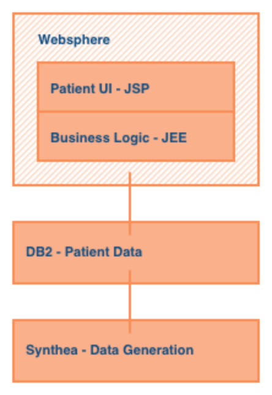
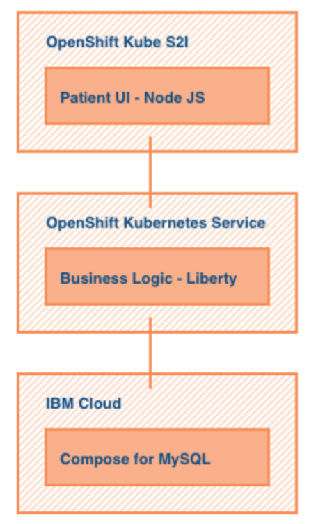
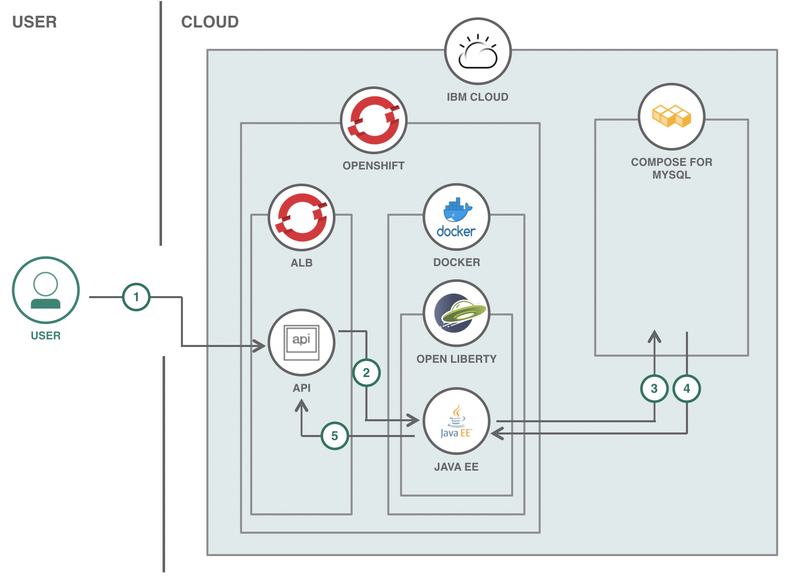
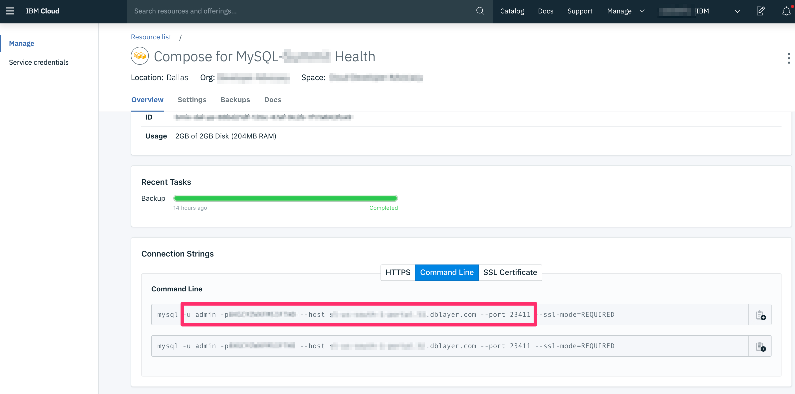
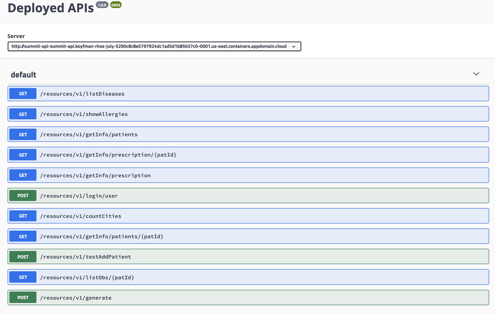
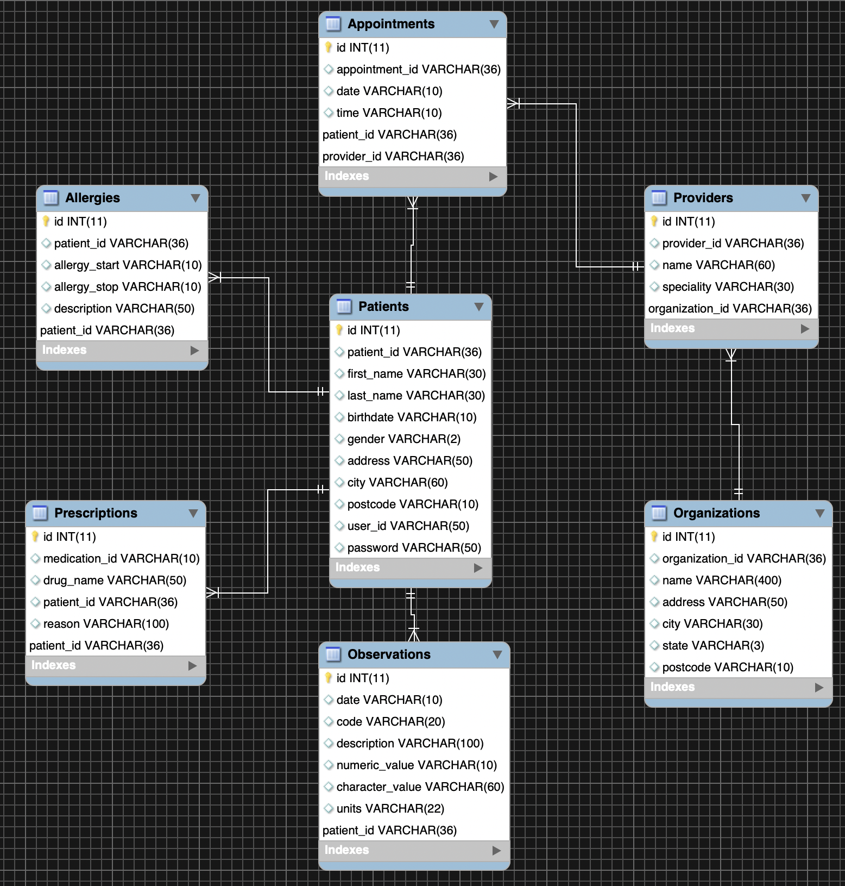
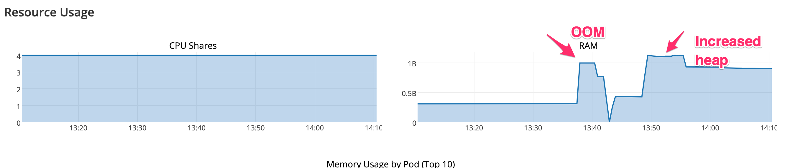

# Example Health JEE Application on Openshift

This project is a conceptual Java EE application running on Open Liberty for a health records system, designed to showcase best in class integration of modern cloud technology running on OpenShift.

## Example Health Context

Example Health is a conceptual healthcare/insurance type company. It has been around a long time, and has 100s of thousands of patient records. Example's health records look very similar to the health records of most insurance companies.

Originally, Example Health used a monolithic application structure for their application. Their application structure was a full stack Java application running on WebSphere connected to a DB2 database on System z. Here's what the original architecture for Example Health looked like: 



Recently, Example Health decided to modernize their application and break it up into microservices. They decided to move to a SQL database connected to a Java EE application running on Open Liberty for the business logic and a Node.js application for the Patient UI. In addition, Example Health also decided to bring these applications to Openshift in the Cloud. The new current architecture for Example Health looks like this: 



Since moving to Openshift, Example Health has expanded to include new microservices that include an Admin application and an Analytics application. These along with the Patient UI can be found in seperate code patterns:


1. [Creating a Health Data Analytics App](https://developer.ibm.com/patterns/creating-a-health-data-analytics-app-with-legacy-mainframe-code-and-cloud/)

2. [Application modernization with the Source-to-Image toolkit and OpenShift](https://github.com/IBM/node-s2i-openshift) 
 
3. [PHP Admin Front-end](https://github.com/IBM/summit-health-admin)


# Architecture



1. User makes a call to one of the APIs for the Java EE application which is located in Openshift's application load balancer.
2. The API in Openshift's application load balancer triggers the API endpoint code in the Java EE application that is running on an Open Liberty server in a Docker container on Openshift.
3. The Java EE application queries the MySQL database to get the desired data.
4. The MySQL database sends back the data to the Java EE application where it gets handled accordingly.
5. The data gets configured into JSON format that gets returned to the API and User.

# Steps

1. Install the following prerequisite tools.
    * A Java 8 (or higher) JDK such as [OpenJDK](https://openjdk.java.net/install/index.html)
    * [Maven](https://maven.apache.org/download.cgi)
    * [Docker](https://www.docker.com/get-started)
    * [IBM Cloud CLI](https://cloud.ibm.com/docs/cli?topic=cloud-cli-getting-started)
    * [OpenShift (oc) CLI](https://www.okd.io/download.html)
	* [MySQL client](https://dev.mysql.com/downloads/)

2. [Sign up for an IBM Cloud account](https://cloud.ibm.com/docs/account?topic=account-signup) if you do not have one.
   You must have a Pay-As-You-Go or Subscription account to deploy this code pattern.  See https://cloud.ibm.com/docs/account?topic=account-upgrading-account to upgrade your account.

3. Create a [IBM Cloud Red Hat OpenShift Container Platform cluster](https://cloud.ibm.com/docs/containers?topic=containers-openshift_tutorial)

4. Create a [Compose for MySQL database](https://cloud.ibm.com/catalog/services/compose-for-mysql).  After the database is provisioned, make note of its URL, port, user and password.

5. Clone this project.
    ```
    git clone https://github.com/IBM/example-health-jee-openshift.git
	```

6. Create the database and tables using a MySQL client. Import the SQL schema for the the [Synthea](https://github.com/synthetichealth/synthea) simulated patient record data using the SQL file at: `example-health-api/samples/health_schema.sql`.

7. Build the Java EE application.
    ```
    cd example-health-api
    mvn package
    ```

8. Build the Java EE docker image.
   ```
   docker build -t ol-example-health:1
   ```

9. Create a repository in your dockerhub account and push the Java EE docker image to it.  (Substitute your account name into the commands.)

   ```
   docker tag ol-example-health:1 YOURACCOUNT/ol-example-health:1
   docker login -u YOURACCOUNT
   docker push YOURACCOUNT/ol-example-health:1
   ```

10. Create a project (like a namespace) in OpenShift. This will create a new project and set it as the working project where pods and services will get deployed.

	```
	oc new-project health
	```
	
11. Edit the file `example-health-api/kubernetes-openshift.yaml` to change the `image` key to your docker image.

12. Set the secret values for your MySQL cloud deployment in the `example-health-api/create-secrets.sh` script. All the necesssary values can be found in the IBM Cloud MySQL service credentials page:



> NOTE: The connection URL would resemble the following. Substitute the server name and port from the Cloud service page above. The value of `DB_NAME` use the database created and populated with the tables in step 6 above.
```
    --from-literal=db_host="jdbc:mysql://$HOST:$PORT/$DB_NAME?sessionVariables=sql_mode=''"
```

Run the script to load the secrets into the OpenShift project.

```
$  ./create-secrets.sh 
secret/db-secrets created
```

The Open Liberty DataSource configuration in `server.xml` uses environment variables injected into the
container by the deployment yaml via Kubernetes secrets to set database access parameters:

```xml
    <dataSource id="DefaultDataSource" jndiName="jdbc/health-api" jdbcDriverRef="mysql-driver"
                type="javax.sql.ConnectionPoolDataSource" transactional="true">

        <properties url="${ENV_MYSQL_URL}"
                    user="${ENV_MYSQL_USER}"
                    password="${ENV_MYSQL_PWD}"/>
```

13. Deploy the application to your cluster.
    ````
    oc apply -f kubernetes-openshift.yaml
    ```` 

14. Create a route to expose the application to the internet.
    ````
    oc expose svc example-health-api
    ````

15. Verify that the application is working.  First obtain the hostname assigned to the route.
    ````
    oc get route example-health-api
	
	NAME                 HOST/PORT                        PATH         SERVICES     PORT      TERMINATION   WILDCARD
	example-health-api   example-health-api-health.****.appdomain.cloud   example-health-api   http                    None
	
    ````

    In a browser window, navigate to `<hostname>/openapi/ui/`.  An OpenAPI specification of the endpoints and operations supported by the Java EE application appears.


16. Generate synthentic patient health records and populate the MySQL database by running the `generate.sh` script in `generate/`. Refer to the script's [README](generate/README.md) for instructions on how to run the script. 

	> NOTE: In our testing, the script populates the MySQL database at about 125 patients per hour.

	> NOTE: This directive in `liberty.xml` is necessary to allow long-running patient load operations via REST:  `<transaction totalTranLifetimeTimeout="3600s"/>`. The default timeout of 120 seconds is too
short to batch patients at 50 per call, as the current script is configured.


Once the application is up and running, the OpenAPI UI will allow you to browse the available APIs:



# SQL Schema

The SQL schema in for `Synthea` derived data imported into Example Health uses this logical pattern and maps tables to Java classes under `src/main/java/com/ibm/examplehealth` mapped using JPA annotation. 

```java
Allergy.java     :@Table(name="Allergies")
Appointment.java :@Table(name="Appointments")
Provider.java    :@Table(name="Providers")
Organization.java:@Table(name="Organizations")
Prescription.java:@Table(name="Prescriptions")
Observation.java: @Table(name="Observations")
Patient.java:     @Table(name="Patients")
```




# Open Liberty in OpenShift

## Build a Liberty container for using JPA with a JDBC driver

This project builds its OpenLiberty container based on the RedHat UBI, Universal Base Image:
https://www.redhat.com/en/blog/introducing-red-hat-universal-base-image

To ensure that your Docker container works in the more security conscious environment of OpenShift, use Libert 19.0.0.5 or higher
see:  https://openliberty.io/blog/2019/03/28/microprofile22-liberty-19003.html#docker.   In addition, to install the JDBC driver, note
that `chown` option to `ADD` and the `chmod` needed to give the JVM permission to read the JDBC driver. 


Part of the `Dockerfile` used to build the image downloads the MySQL JDBC driver to connect to our cloud MySQL instance.

```
ADD --chown=default:root https://repo1.maven.org/maven2/mysql/mysql-connector-java/8.0.16/mysql-connector-java-8.0.16.jar  ${INSTALL_DIR}lib/mysql-connector-java-8.0.16.jar
RUN chmod 644 ${INSTALL_DIR}lib/mysql-connector-java-8.0.16.jar
COPY liberty-mysql/mysql-driver.xml ${CONFIG_DIR}configDropins/defaults/
```

The `persistence.xml` specifies the driver details that is injected as the default persistence context via 
CDI:

```xml
    <jdbcDriver id="mysql-driver"
                javax.sql.XADataSource="com.mysql.cj.jdbc.MysqlXADataSource"
                javax.sql.ConnectionPoolDataSource="com.mysql.cj.jdbc.MysqlConnectionPoolDataSource"
                libraryRef="mysql-library"/>

    <library id="mysql-library">
	    <fileset id="mysqlFileSet" dir="/opt/ol/wlp/lib"
                 includes="mysql-connector-java-8.0.16.jar"/>
    </library>
```

We don't need to specify any persistence context in this annotation because only one is defined:

```java
    @PersistenceContext
    EntityManager entityManager;
```

# Memory management during bulk loading

## Clear EntityManager during bulk load

Because by default transactions are handled on a per call basis, when loading many records (100s of MBs) via `generate`, we noticed memory usage rose dramatically as the EntityManager instantiated Java objects representing each database table. Running `clear()` during batch
processing allowed memory to be reclaimed after entites were pushed to MySQL.

```java
    private void flushBatch(int size, int cnt, String type) {
        if ( (cnt % batchSize == 0) || (size == cnt) )  {
		    entityManager.flush();
            entityManager.clear();
        }
    }
```

## Update the gateway timeout settings to allow long running APIs.

The default OpenShift timeout for the gateway is 30 seconds, too short for long running REST calls like the `generate` endpoint to load health data. It's necessary to set the route timeout to a longer value for the route defined for the health API:

```
  #   oc annotate route example-api --overwrite haproxy.router.openshift.io/timeout=60m
   route.route.openshift.io/example-api annotated
```

# Setting up JPA for OpenLiberty

We set up a Data Source to allow Open Liberty to manage our connections to the MySQL database via 
the MySQL JDBC driver. For more details, see this Open Liberty guide: https://openliberty.io/guides/jpa-intro.html

The `persistence.xml` specifies the driver details that is injected as the default persistence context via 
CDI:

```xml
    <jdbcDriver id="mysql-driver"
                javax.sql.XADataSource="com.mysql.cj.jdbc.MysqlXADataSource"
                javax.sql.ConnectionPoolDataSource="com.mysql.cj.jdbc.MysqlConnectionPoolDataSource"
                libraryRef="mysql-library"/>

    <library id="mysql-library">
	    <fileset id="mysqlFileSet" dir="/opt/ol/wlp/lib"
                 includes="mysql-connector-java-8.0.16.jar"/>
    </library>
```

We don't need to specify any persistence context in this annotation because only one is defined:

```java
    @PersistenceContext
    EntityManager entityManager;
```


# Memory management during bulk loading

## Clear EntityManager during bulk load

Because by default transactions are handled on a per call basis, when loading many records (100s of MBs) via `generate`, we noticed memory usage rose dramatically as the EntityManager instantiated Java objects representing each database table. Running `clear()` during batch
processing allowed memory to be reclaimed after entites were pushed to MySQL.

```java
    private void flushBatch(int size, int cnt, String type) {
        if ( (cnt % batchSize == 0) || (size == cnt) )  {
		    entityManager.flush();
            entityManager.clear();
        }
    }
```

## Increase JVM Heap size


The OpenShift dashboard is helpful in problem determination, in our case memory exhaustion due to the default 1GB JVM heap size during bulk loading via JPA:

Memory exhastion (hard limit at 1GB and rapid drop off as the call fails and cleanup occurs):




To solve this problem, we an option in `jvm.options` to increase the amount of memory available to the JVM above the default 1GB heap size:

``` 
-Xmx4096m
```

And added this to the image by adding this line in the `Dockerfile`:


```
COPY liberty/jvm.options $CONFIG_DIR
```


The OpenShift monitoring dashboard shows how container memory is able to exceed the 1GB threshold when necessary (in this case, the peak is caused by JSON-B parsing JSON inpout to the REST call that generates simulated health records):


# License

This code pattern is licensed under the Apache License, Version 2. Separate third-party code objects invoked within this code pattern are licensed by their respective providers pursuant to their own separate licenses. Contributions are subject to the [Developer Certificate of Origin, Version 1.1](https://developercertificate.org/) and the [Apache License, Version 2](https://www.apache.org/licenses/LICENSE-2.0.txt).

[Apache License FAQ](https://www.apache.org/foundation/license-faq.html#WhatDoesItMEAN)
